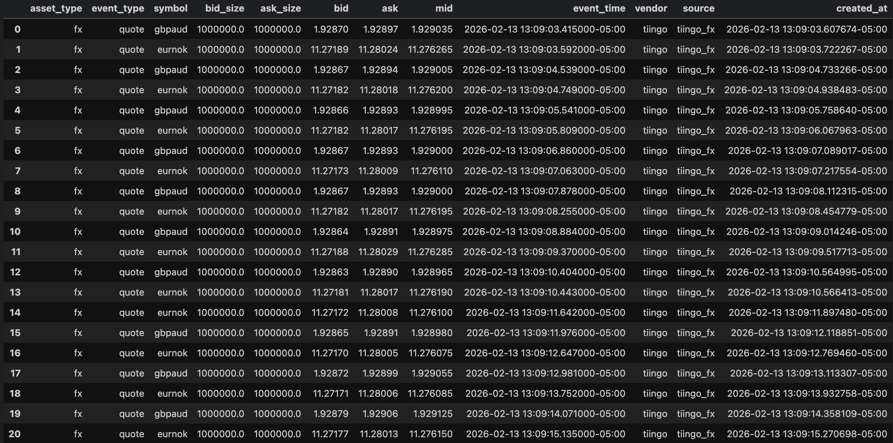
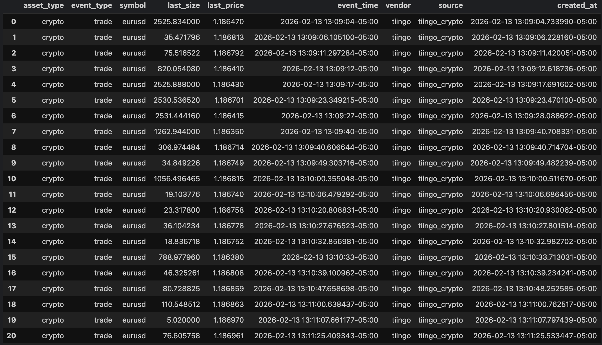
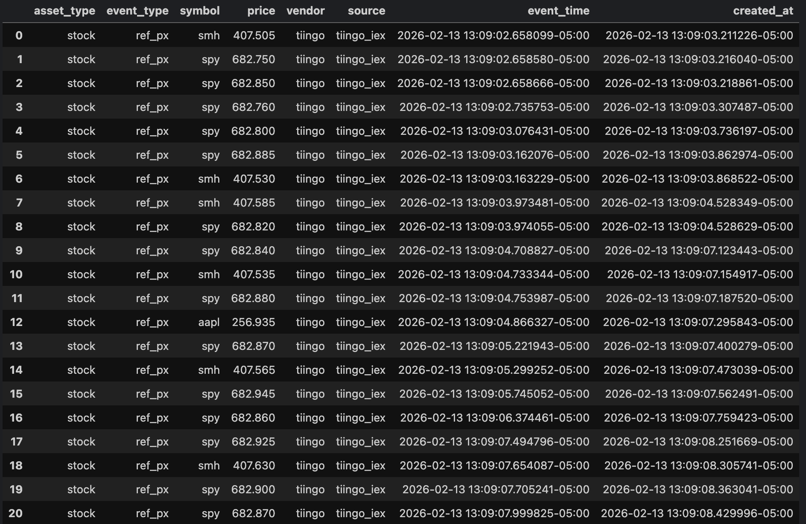

# Event Driven Connectivity

## Description
This project collects market data (stocks, ETFs, FX, crypto) from several vendors such as Tiingo, via websockets, webhooks (to be implemented) and async polling.\
It performs simple data normalisation and writes consolidated event-driven feeds by event type (trade, quote, reference price) to Parquet files for downstream analytics.

⚠️ Designed for demonstration purposes only.\
The main goal is to **showcase connectivity and consolidation of event-driven feeds** from multiple data sources, not to provide a production-ready system or perform data analytics.

## Features
- Async streaming of multiple asset types (stocks, ETFs, FX, crypto)
- Buffering of incoming feeds to reduce memory overhead
- Multi-queue design for different event types from multiple data feeds
- Simple normalisation of feed data
- Batch saving to Parquet storage with partitioning by event type and time

## Design Highlights
- Async architecture demonstrates concurrent ingestion of event-driven feeds with multiple asset types
- Python asyncio queues decouples feeds. Can be replaced with Kafka, RabbitMQ, Redis etc.
- Batch Parquet partitioning ensures manageable file sizes
- Deduplication ignores created_at to preserve system ingestion timestamps


## Installation & Set Up
#### 1. Create virtual environment
cd to project directory, create and activate virtual environment
```
cd <path>/event-driven-connectivity
python -m venv venv
source venv/bin/activate
```
#### 2. Replace API keys
In src/data/data_config.py, replace TIINGO_WS_KEY with own Tiingo API key


## Run & Usage

Starting the main application:
```bash
uvicorn src.main:app --port 8000 --reload (for development)
uvicorn src.main:app --port 8000
```
Stopping and Restarting the Process (Eg. Port in use 8000):
Ctrl + C
- On Unix systems
```bash
lsof -i :8000
kill -9 <pid>
```

- On Windows systems
```bash
netstat -ano | findstr :8000
taskkill /PID <pid> /F
```

## How it Works
- Each feed (stocks, FX, crypto) has its own async queue based on the event type (trade, quote, reference price).
- Data is normalized before pushing to the respective queue.
- Once the buffer reaches a threshold or on shutdown, data is flushed to Parquet files.
- Parquet files are named like: `consol_feeds_quote_20260213_130922_668051.parquet`.

## Notes
- New York timezone (America/New York) is used for timestamps for consistency
- Deduplication ignores the created_at column

## Future Enhancements
- Add latency metrics for each feed to monitor real-time performance
- Implement graceful shutdown handling for all async queues
- Replace asyncio queues with Kafka/ RabbitMQ/ Redis for production scalability
- Support additional vendors and data sources

## Sample Screenshots
### Sample Parquet Data
*Example Parquet file and data shown here has been adjusted and does not contain any real vendor data.*\
Consolidated Quotes Feeds:
\
Consolidated Trades Feeds:
\
Consolidated Reference Prices Feeds:


## Disclaimer & Usage Policy
This repository contains code developed for **educational and demonstration purposes only**.
- **"As-Is":** Provided without any express or implied warranties of merchantability, fitness for a particular purpose, or non-infringement.
- **No Liability:** All liability is disclaimed for damages, data loss, or issues arising from use or misuse.  
- **No Downloads/Distribution:** Do **not** download or deploy this code for actual applications without review and modification.
- **Data:** Any sample data shown is placeholder or dummy data, not real or redistributed information.


